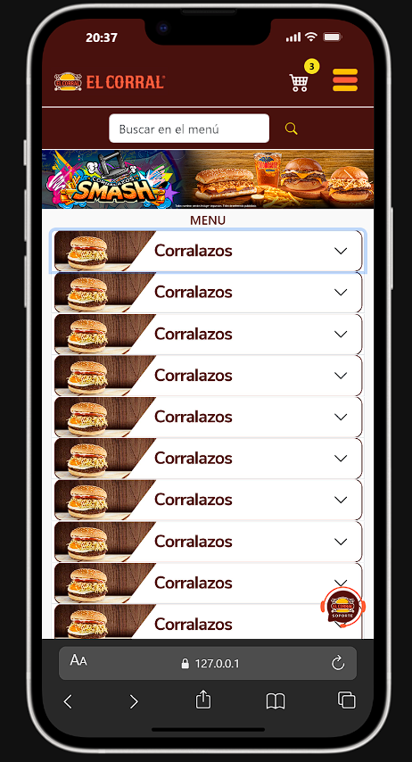
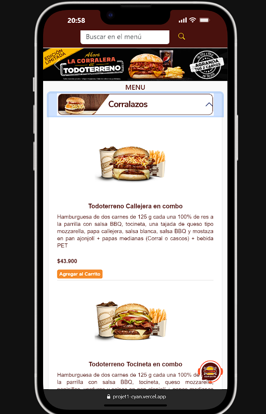
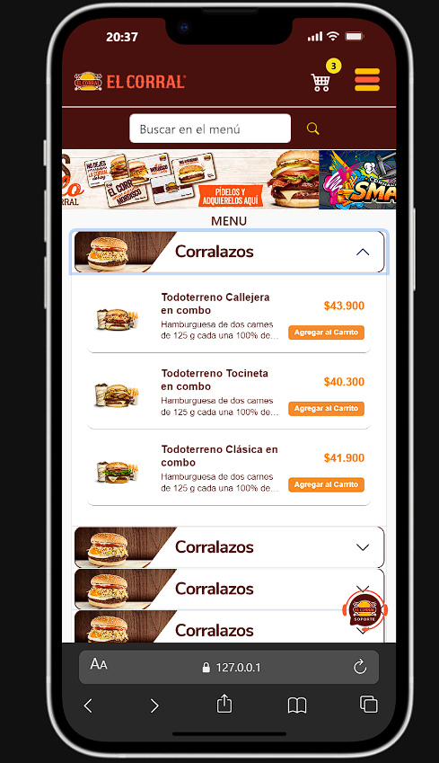
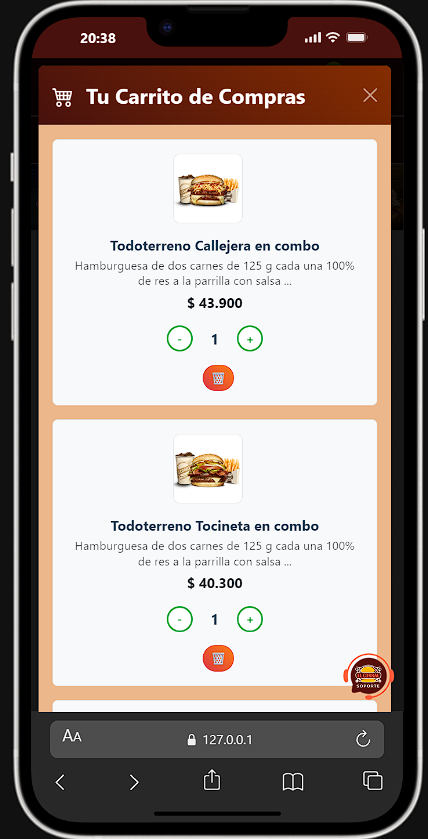

# 🍔 El Corral - Full-Stack E-commerce

> **Nota:** Este es un proyecto desarrollado con **fines académicos y educativos**. Representa una réplica técnica para fines de aprendizaje en desarrollo web full-stack y no tiene vinculación comercial oficial.

## 📸 Vista Previa del Proyecto

### Versión Desktop
| Pantalla Principal | Menú y Selección |
| :---: | :---: |
|  |  |

### Versión Mobile
| Inicio Mobile | Categorías | Detalle Carrito |
| :---: | :---: | :---: |
|  |  |  |

---

## 🛠️ Stack Tecnológico

### Frontend
- **Arquitectura:** Prototipado con HTML5 semántico y CSS3 avanzado (Metodología BEM).
- **Framework UI:** Bootstrap 5.3 para sistemas de grids y componentes responsivos.
- **Lógica de Cliente:** Vanilla JavaScript (ES6+) para manipulación del DOM y gestión de eventos.
- **Persistencia:** LocalStorage para mantenimiento de estado del carrito en sesión.

### Backend
- **Framework:** Node.js con Express.js para la gestión de API REST y enrutamiento.
- **Seguridad y Entorno:** Implementación de CORS y Dotenv para gestión de variables sensibles.
- **Automatización:** Integración de Nodemailer para comunicaciones transaccionales.

---

## ⚙️ Funcionalidades Principales

- **Carrito de Compras Dinámico:** Sistema persistente con lógica de cálculo de totales e impuestos en tiempo real.
- **Generación de Factura Automática:** Procesamiento en backend que genera y envía facturas detalladas en formato HTML directamente al correo del cliente tras confirmar el pedido.
- **Integración de ChatBot:** Interfaz interactiva para asistencia al usuario y resolución de dudas frecuentes mediante lógica de mensajería programada.
- **Optimización Mobile-First:** UX adaptada específicamente para dispositivos móviles mediante Media Queries personalizadas.

---

## 🚀 Despliegue Local

1. **Backend:** Instalar dependencias con `npm install` dentro de la carpeta `backend`.
2. **Variables de Entorno:** Configurar `.env` con las credenciales SMTP (`EMAIL_USER`, `EMAIL_PASS`).
3. **Ejecución:** Iniciar el servidor con `node backend/server.js`.
4. **Acceso:** Abrir `frontend/index.html` (o `index.html` raíz) mediante un servidor estático.

---
**Desarrollado por:** Carlos Namias 🛸🧑🏽‍💻😎
